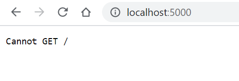

MERN Demo using (MongoDB, Express.js, React.js, and Node.js)
Here is a list of steps we are going through this demo:
- [ ] Set up the server
- [ ] Venus
- [ ] Earth (Orbit/Moon)
- [ ] Mars
- [ ] Jupiter
- [ ] Saturn
- [ ] Uranus
- [ ] Neptune
- [ ] Comet Haley

---

# Set up the server
- Create a `server` folder using the command:
    `nabil828@DESKTOP-0AB0QNR:~/mern_demo$ mkdir server`. Now, Express.js is the framework that we will use to build the server. It is defined as
>Fast, unopinionated, minimalist web framework for Node.js

- [[Source]](https://expressjs.com/en/starter/installing.html) Install Express using the following commands:
```
nabil828@DESKTOP-0AB0QNR:~/mern_demo/server$ npm init
This utility will walk you through creating a package.json file.
It only covers the most common items, and tries to guess sensible defaults.

See `npm help json` for definitive documentation on these fields
and exactly what they do.

Use `npm install <pkg>` afterwards to install a package and
save it as a dependency in the package.json file.

Press ^C at any time to quit.
package name: (server)
version: (1.0.0)
description:
entry point: (index.js)
test command:
git repository:
keywords:
author: NAbil
license: (ISC)
About to write to /home/nabil828/mern_demo/server/package.json:

{
  "name": "server",
  "version": "1.0.0",
  "description": "",
  "main": "index.js",
  "scripts": {
    "test": "echo \"Error: no test specified\" && exit 1"
  },
  "author": "NAbil",
  "license": "ISC"
}


Is this OK? (yes)
nabil828@DESKTOP-0AB0QNR:~/mern_demo/server$ npm install express --save
npm notice created a lockfile as package-lock.json. You should commit this file.
npm WARN server@1.0.0 No description
npm WARN server@1.0.0 No repository field.

+ express@4.17.1
added 50 packages from 37 contributors and audited 50 packages in 4.488s
found 0 vulnerabilities
```
- Open the server folder using atom `atom ~/mern_demo/server` and create a new file `server.js`

- change the entry point to `server.js` in the `package.josn` file. This the home page of the server when it the http://localhost:port url s requested.  

- [[Source]](https://expressjs.com/en/5x/api.html#express) Create an Express.js application by copying these two line
```
const express = require('express')
const app = express()
```
into your server.js .

- [[Source]](https://expressjs.com/en/5x/api.html#app.listen) Assign port 5000 to the server using the following code:
```
app.listen(5000)
```
**OR** even better, add a call back function as a second argument to the previous `listen` function so we can print out any errors on the run time:
```
app.listen(5000, function(err){
  if(err) console.log(err);
  })
```

- start the server by typing `$nodemon server.js`

- test the server by visiting `http://localhost:5000` in your browser.
You should get the following output:

We will fix the server to accept get request soon 😉.
