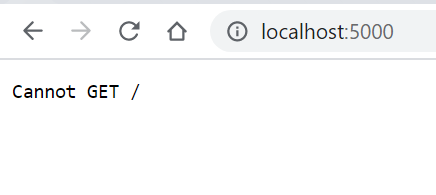
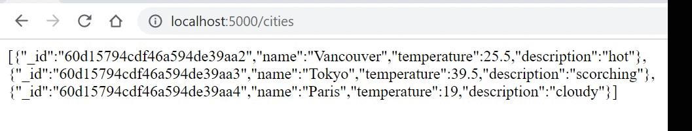
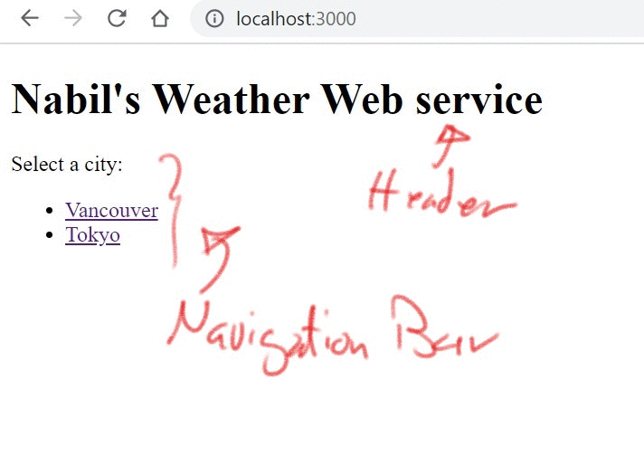

VoilàMERN Demo using (MongoDB, Express.js, React.js, and Node.js)
Here is a list of steps we are going through this demo:
- [ ] Setting up the server
- [ ] Routing in Express
- [ ] REST API - Round one
- [ ] Mongo DB & REST API - Round two
- [ ] React & REST aPI - Round three

---

# Setting up the server
- Create a `server` folder using the command:
    `nabil828@DESKTOP-0AB0QNR:~/mern_demo$ mkdir server`. Now, Express.js is the framework that we will use to build the server. It is defined as
  >Fast, unopinionated, minimalist web framework for Node.js

- [[Source]](https://expressjs.com/en/starter/installing.html) Install Express using the following commands:
```
nabil828@DESKTOP-0AB0QNR:~/mern_demo/server$ npm init
This utility will walk you through creating a package.json file.
It only covers the most common items, and tries to guess sensible defaults.

See `npm help json` for definitive documentation on these fields
and exactly what they do.

Use `npm install <pkg>` afterwards to install a package and
save it as a dependency in the package.json file.

Press ^C at any time to quit.
package name: (server)
version: (1.0.0)
description:
entry point: (index.js)
test command:
git repository:
keywords:
author: NAbil
license: (ISC)
About to write to /home/nabil828/mern_demo/server/package.json:

{
  "name": "server",
  "version": "1.0.0",
  "description": "",
  "main": "index.js",
  "scripts": {
    "test": "echo \"Error: no test specified\" && exit 1"
  },
  "author": "NAbil",
  "license": "ISC"
}


Is this OK? (yes)
nabil828@DESKTOP-0AB0QNR:~/mern_demo/server$ npm install express --save
npm notice created a lockfile as package-lock.json. You should commit this file.
npm WARN server@1.0.0 No description
npm WARN server@1.0.0 No repository field.

+ express@4.17.1
added 50 packages from 37 contributors and audited 50 packages in 4.488s
found 0 vulnerabilities
```
- Open the server folder using atom `atom ~/mern_demo/server` and create a new file `server.js`

- change the entry point to `server.js` in the `package.josn` file. This the home page of the server when it the http://localhost:port url s requested.  

- [[Source]](https://expressjs.com/en/5x/api.html#express) Create an Express.js application by copying these two line
```
const express = require('express')
const app = express()
```
into your server.js .

- [[Source]](https://expressjs.com/en/5x/api.html#app.listen) Assign port 5000 to the server using the following code:
```
app.listen(5000)
```
**OR** even better, add a call back function as a second argument to the previous `listen` function so we can print out any errors on the run time:
```
app.listen(5000, function(err){
  if(err) console.log(err);
  })
```

- start the server by typing `$node server.js`
**OR** even better, use `$nodemon server.js` to keep the server running while you are making edits. To install, run `npm install -g nodemon`.

- Test the server by visiting `http://localhost:5000` in your browser.
You should get the following output:
  
We will fix the server to accept get request soon 😉.

- You may now add a handle for GET requests:
```
app.get('/', function (req, res) {
  res.send('GET request to homepage')
})
```
The first argument is the relative path to server homepage.
The second arument is a call function the will hold the `req` variable for the request object. And the `res` variable for the response object. we use the method `res.send()` to send a message back to the client:
  
You may even embed HTML in your response's string.

# Routing in Express
So far we had one route to our server. Namely, the '/' route. If we want clients to visit other ~~pages~~ routes, we can handle these requests in such a way:
```
app.get('/contact', function (req, res) {
  res.send('Hi there, here is my <a href="mailto:nabil@eceubc.ca"> email </a>.')
})
```
Output:
  

# REST API
> [[Source]](https://rapidapi.com/blog/most-popular-api/) API stands for Application Programming Interface and allows your application to interact with an external service using a simple set of commands.

out of 10,000 APIs out there in the wild, we will be interacting with the [[openweathermap]](https://openweathermap.org/api) API to get weather and weather forecasts for multiple cities. Our Express server will act as client in this interaction.
- Create a free account on [[openwathermap]](https://openweathermap.org/price) website.
- [[API call guide]](https://openweathermap.org/current) Using your API key, test an API call by pasting this link into the browser, replacing the API key with yours:
```
api.openweathermap.org/data/2.5/weather?q={city name}&appid={API key}
```

Here is the formatted JSON reply from the API server([[Using pretty-json package in Atom]](https://atom.io/packages/pretty-json)):
```
{
  "coord": {
    "lon": -123.1193,
    "lat": 49.2497
  },
  "weather": [
    {
      "id": 801,
      "main": "Clouds",
      "description": "few clouds",
      "icon": "02d"
    }
  ],
  "base": "stations",
  "main": {
    "temp": 295.57,
    "feels_like": 295.51,
    "temp_min": 290.72,
    "temp_max": 299.8,
    "pressure": 1012,
    "humidity": 63
  },
  "visibility": 10000,
  "wind": {
    "speed": 1.79,
    "deg": 314,
    "gust": 7.15
  },
  "clouds": {
    "all": 20
  },
  "dt": 1624294720,
  "sys": {
    "type": 2,
    "id": 2011597,
    "country": "CA",
    "sunrise": 1624277221,
    "sunset": 1624335698
  },
  "timezone": -25200,
  "id": 6173331,
  "name": "Vancouver",
  "cod": 200
}
```
## GET request from our server to external server & Parsing the JSON response
With the help [[HTTPS module]](https://nodejs.org/api/https.html#https_https_get_url_options_callback) in node js make a get request to this api to get Vancouver weather.

```
app.get("/", function(req, res) {
  var cityName = 'Vancouver';
  var apikey = "b660f3402c54cb9a9c48f89c35249e5c"
  const url = "https://api.openweathermap.org/data/2.5/weather?q=" + cityName + "&units=metric&appid=" + apikey

  https.get(url, function(https_res) {
      https_res.on("data", function(data) {  
      res.write("<h1> " + cityName + " weather is " + JSON.parse(data).weather[0].description) + "</h1>";
      res.write("<h1> " + cityName + " temp is " + JSON.parse(data).main.temp) + "</h1>";

      // console.log(JSON.parse(data).weather[0].icon );
      res.write('  ");
      res.send();
    })
  });

})
```

Notice how we use `res.write` multiple times to before calling `res.send`. Check the top answer in this [[stackoverflow post]](https://stackoverflow.com/questions/44692048/what-is-the-difference-between-res-send-and-res-write-in-express) to understand the difference between `res.write` and `res.send`. The key difference is `res.send` can be called only once where as `res.write` can be called multiple times followed by a `res.end`.


## Handle a POST request to our server & Using the body parser
Before continuing check and compare the browse the [base code so far](https://github.com/nabil828/mern_demo/tree/d02e63cdc6fc1b06be68c682a8df3a51514d084f).

Now, we want to enable the user to enter a city name and get live weather data from the openwathermap API through our server. Something like this:


- First, we will be changing the `app.get('/')` to return an html file instead of an html code and move the previous code in `app.get('/')` to `app.post('/')` as such:

```
app.get('/', function(req, res) {
  res.sendFile(__dirname + "/index.html");
})

app.post("/", function(req, res) {
  // res.send("post req received" + req.body.cityName);
  const url = "https://api.openweathermap.org/data/2.5/weather?q=" + req.body.cityName + "&units=metric&appid=" + apikey

  https.get(url, function(https_res) {
    https_res.on("data", function(data) {
      res.write("<h1> " + req.body.cityName + " weather is " + JSON.parse(data).weather[0].description) + "</h1>";
      res.write("<h1> " + req.body.cityName + " temp is " + JSON.parse(data).main.temp) + "</h1>";

      // console.log(JSON.parse(data).weather[0].icon );
      res.write('  ");
      res.send();
    })
  });

})


```
Notice how we are sending now `index.html` file back to the browser client whenever to send a GET for the root directory of our web server. Here is the content of `index.html`:

```
<!DOCTYPE html>
<html lang="en" dir="ltr">
  <head>
    <meta charset="utf-8">
    <title> Live Weather Application</title>
  </head>
  <body>
    <h1> Enter City Name:</h1>

    <form method="post">

      <label> City Name</label>

      <input type="text" name="cityName" placeholder="Enter City Name">
      <input type="submit" value="submit">
    </form>

  </body>
</html>

```
Also, notice that we are using now `res.sendFile()` instead of `res.send()` to send a whole html file. In `index.html`, we have built a simple form for the user to enter the city of interest.
Once the user hit button, a post request will be send to our server and will be caught by `app.post('/')`. Again, the argument `/` indicates that the post request was originated from the root/home page.

- Next, we need to parse the POST request using `body-parser` module. It allows use to use the property `req.body` to get the entered city name.
copy the next lines at the begining of `server.js`:
```
const bodyparser = require("body-parser");
app.use(bodyparser.urlencoded({
  extended: true
}));
```
check out [[https://www.npmjs.com/package/body-parser]](https://www.npmjs.com/package/body-parser) for full documentation of this module/middleware.

- Finally, add the api key from your openweathermap account page.
```
const apikey = "b660f3402c54cb9a9c48f89c35249e5c";
```
run `http://localhost:5000` on your server and Voila!
[Check out the code at this stage](https://github.com/nabil828/mern_demo/tree/e67c18b706c68bb03b9ded771ae29549836ff882) .

# Mongo DB
Before talking about the other REST operations, namely PUT and DELETE, let us build a database on our server to serve such requests. Now, we want to build our own weather service and not make any calls to openwathermap.

- First, let us install mongodb using our terminal
```
sudo apt-get install mongodb
```  
and run the mongodb service Using
```
sudo service mongodb start
```
and log in to the database terminal using
```
$ mongo
```
command.

- Next, create and use `test` db using
```
use test
```
and create and populate `cities` collection using
```
> db.cities.insert([{name:'Vancouver', tempreture:25.5, description:'hot'},{name:'Tokyo', tempreture:39.5, description:'scorching'},{name:'Paris', tempreture:'19', description:'cloudy'}]);
BulkWriteResult({
        "writeErrors" : [ ],
        "writeConcernErrors" : [ ],
        "nInserted" : 3,
        "nUpserted" : 0,
        "nMatched" : 0,
        "nModified" : 0,
        "nRemoved" : 0,
        "upserted" : [ ]
})
> db.cities.find().pretty();
{
        "_id" : ObjectId("60d15794cdf46a594de39aa2"),
        "name" : "Vancouver",
        "temperature" : 25.5,
        "description" : "hot"
}
{
        "_id" : ObjectId("60d15794cdf46a594de39aa3"),
        "name" : "Tokyo",
        "temperature" : 39.5,
        "description" : "scorching"
}
{
        "_id" : ObjectId("60d15794cdf46a594de39aa4"),
        "name" : "Paris",
        "temperature" : "19",
        "description" : "cloudy"
}
```
Now the database is created and running. We now need to access it through the Express server.

- Install [`mongoose`](https://mongoosejs.com/docs/) module to enable us to access mongodb from the server code.
```
mongoose.connect("mongodb://localhost:27017/test",
 {useNewUrlParser: true, useUnifiedTopology: true});
const citySchema = new mongoose.Schema({
    name: String,
    temperature: Number,
    description: String
});
const cityModel = mongoose.model("cities", citySchema);
```
The `mongoose.connect` function call will establish the connection to the db. The `citySchema` variabale should match the schema of your collection in the mongodb. The `cityModel` object is going to be used to help us to pass SQL queries to the db.

- Now moving to the fun part. Let us add these *routes* in the server code to match, a GET(retrieve all), GET(retrieve one), POST(insert one), PUT(update one), & DELETE(delete all/one) requests.  

Something along these lines:
```
app.use(bodyParser.json());

app.get('/cities', (req, res) => {
  const articles = [];
  // code to retrieve all cities...
  res.json(articles);
});

app.post('/cities', (req, res) => {
  // code to add a new city...
  res.json(req.body);
});

app.put('/cities/:name', (req, res) => {
  const { name } = req.params;
  // code to update an article...
  res.json(req.body);
});

app.delete('/articles/:name', (req, res) => {
  const { name } = req.params;
  // code to delete an article...
  res.json({ deleted: id });
});
```
Note how these REST API calls will match the SELECT, INSERT, UPDATE, & DELETE statements. Also, notice how do we retrieve the city name from URL route using the `req.params` [[Source]](https://stackoverflow.blog/2020/03/02/best-practices-for-rest-api-design/).

Here is the routes I implemented:
```
app.get('/cities/:city_name', function(req, res) {
  console.log("received a request for "+ req.params.city_name);
  cityModel.find({name: req.params.city_name}, function(err, cities){
      if (err){
        console.log("Error " + err);
      }else{
        console.log("Data "+ JSON.stringify(cities));
      }
      res.send(JSON.stringify(cities));
  });
})
app.get('/cities', function(req, res) {
  cityModel.find({}, function(err, cities){
      if (err){
        console.log("Error " + err);
      }else{
        console.log("Data "+ JSON.stringify(cities));
      }
      res.send(JSON.stringify(cities));
  });
})
app.post("/insert", function(req, res){
  cityModel.create({
    name : req.body.name,
    temperature : req.body.temperature,
    condition: req.body.condition
  }, function(err, openweathermap){
    if(err) console.log(err);
    else
    console.log(openweathermap);
  });
})
```

This will enable the client for example to list all cities and browse a city by its name:


- To save time of building front end HTML forms to trigger `app.put("/insert")` & `app.delete("/delete")` create matching the following routes:
```
app.put("/insert", function(req, res){
  cityModel.create({
    name : req.body.name,
    temperature : req.body.temperature,
    description: req.body.description
  }, function(err, data){
    if(err) console.log(err);
    else
    console.log(data);
    res.send("All good! Inserted.")
  });
})
app.delete("/delete/:city_name", function(req, res){
  cityModel.remove({
    name : req.body.name
  }, function(err, data){
    if(err) console.log(err);
    else
    console.log(data);
    res.send("All good! Delteted.")
  });
})
```
, we will use a tool called [[Postman]](https://www.postman.com/) to simulate these requests. In the following gif, I am inserting a new city and deleting it using the API.


# React
Now our server is ready to serve but what about our client. so far we had been testing the server by mostly entering the routes dirctly in the browser for GET requests and using Postman for the rest.

We will create a complete client interface using [React.js](https://reactjs.org/) to get somewhat the following:

by clicking on these two react links, each city weather is going to be loaded into the page without the page getting reloaded. All the magic will happen in the background. React will contact the Express server and retrieve the weather of the selected city.

- [[Source]](https://reactjs.org/docs/create-a-new-react-app.html) First, we need to create another directory by executing the following:
```
npx create-react-app client
cd client
npm start
```
